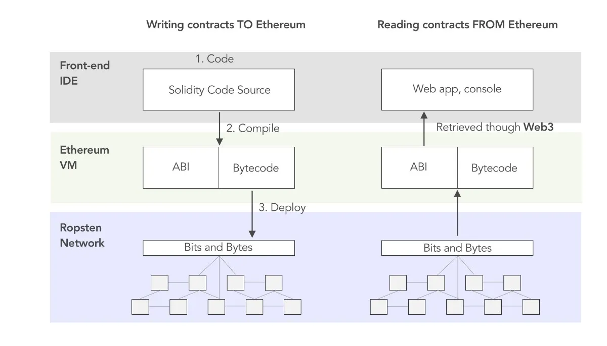
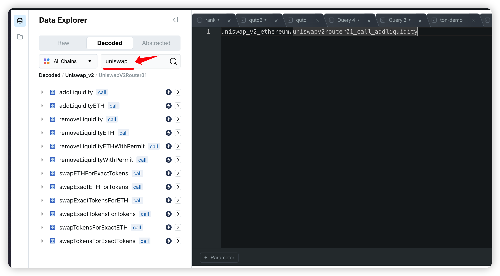
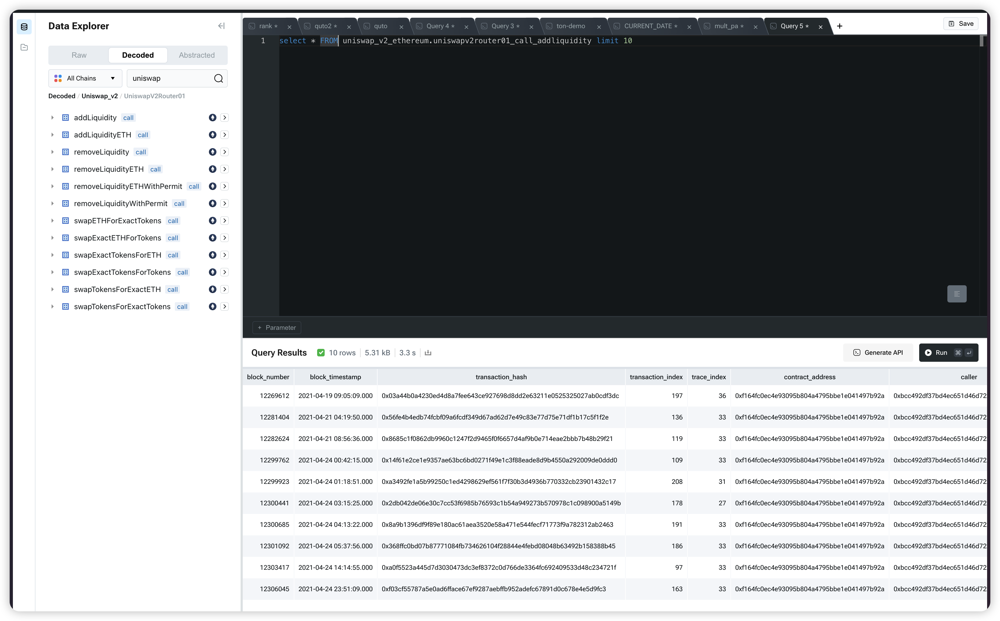

### What is Decoded Blockchain Contract Data?

Decoded blockchain contract data refers to the information extracted from smart contracts on a blockchain that has been translated into a human-readable format. Smart contracts are self-executing contracts with the terms of the agreement directly written into code. They automatically enforce and execute agreements when predetermined conditions are met. However, the raw data from these contracts is often complex and encoded, making it difficult for developers and businesses to interpret and utilize effectively.

As Ethereum uses the EVM (Ethereum Virtual Machine) as a core component of the network, smart contract code written in high-level languages must be compiled into EVM bytecode to execute. EVM bytecode is the executable code on the EVM, while the Contract ABI (Application Binary Interface) is an interface used to interact with EVM bytecode. For example, if you want to call a function in a smart contract using JavaScript, the ABI serves as an intermediary between your JavaScript code and the EVM bytecode, enabling them to interact. The diagram below illustrates the architecture of the Contract ABI, EVM bytecode, and external components (dApp and network). The left side represents the compilation process, while the right side represents the interaction process.

### How Chainbase Provides Technical Solutions for Parsing and Serving Decoded Data

1. Data Extraction and Parsing: Chainbase uses sophisticated algorithms and tools to extract raw data from blockchain nodes. This involves accessing transaction logs, contract calls, and event logs. The data is then parsed to identify relevant information, such as function calls, parameters, and return values.

2. Decoding and Formatting: Once the data is extracted, Chainbase employs specialized decoding libraries and frameworks to translate the encoded data into human-readable formats. This process includes interpreting ABI (Application Binary Interface) specifications, which define how data structures and functions are encoded and decoded in smart contracts.

3. Real-time Data Processing: Chainbase leverages real-time data processing frameworks to ensure that the decoded data is processed and available with minimal latency. This is crucial for applications that require up-to-the-minute information, such as decentralized finance (DeFi) platforms, blockchain analytics tools, and monitoring services.

### Examples

Log in to the chainbase console and select the decoded dataset to search for the smart contract name you want.

### Executing query

    <pre><code>{`select * FROM uniswap_v2_avalanche.uniswapv2router01_call_addliquidity limit 10'`}</code></pre>

