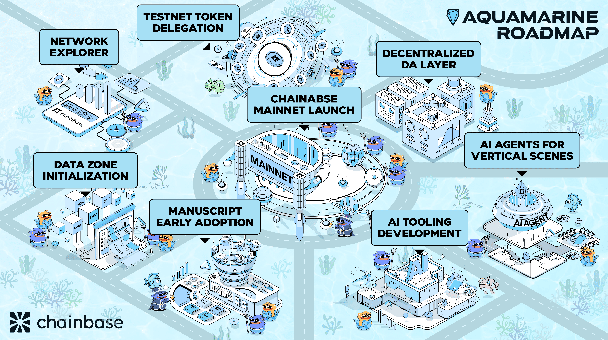

Open blockchains promises a new era of democratized internet. We are building the next-generation data network for the AI era. Our mission is to make data accessible and useful. As the development team behind Chainbase, we are dedicated to creating and supporting networks, protocols, and dApps that unlock the intelligence and value of open data and drive human progress.

The following details Chainbase's path to interoperability, security, and sustainability.

---

## Aquamarine

📅 Mar 20, 2025, 14:30:00 PM +UTC

**Summary**

In ancient lore, aquamarine was the sailor’s stone, offering protection, clarity, and guidance across uncharted waters. It symbolized transformation and renewal, much like the evolution of Chainbase as it advances into its next phase. While Zircon (Genesis) laid the bedrock for a secure and decentralized data network, Aquamarine represents the fluid expansion of this foundation—deepening Web3’s data ecosystem, refining public data standards, and pioneering on-chain AI collaboration.

This phase is crucial as AI and Web3 begin to converge, demanding more scalable, intelligent, and interconnected data solutions. Aquamarine will establish Chainbase as a fundamental public data platform in the AGI era, equipping AI Agents with the infrastructure they need to collaborate and evolve. As the tides of decentralized intelligence rise, Aquamarine is the vessel that will navigate this new frontier.

### **Key Focus Areas for Aquamarine**

- **Chainbase Network Explorer**
    
    Launch a dynamic interface that allows users to navigate and interact with the expanding data ecosystem, ensuring transparency and usability.
    
- **Manuscript Early Adoption**
    
    Enhance Manuscript into a core AI-compatible tech stack, providing structured, verifiable, and scalable data for AI-powered Web3 applications.
    
- **Delegating Tokens on Testnet**
    
    Initiate community engagement by enabling token delegation in a secure, incentivized test environment, laying the groundwork for decentralized governance.
    
- **Initializing Data Zone Development**
    
    Integrate all Manuscripts within their respective Data Zones that serve as the data source for various application scenarios, much like subnets.
    
- **Decentralizing Data Accessibility Layer**
    
    Transform data access by establishing a decentralized network architecture, ensuring open, secure, and universal connectivity across blockchain networks.
    
- **Developing AI Tooling Kit**
    
    Create a comprehensive suite of tools designed specifically for AI Agents, facilitating seamless interaction with on-chain data and empowering automated decision-making.
    
- **Creating AI Agents for Vertical Scenes**
    
    Deploy specialized AI agents tailored for industry-specific applications, enhancing the integration of AI within vertical markets and driving sector-focused innovation.
    
- **Chainbase Network Mainnet Launch**
    
    Transition from testnet to a fully operational main network, solidifying Chainbase’s position as a foundational data network in the age of decentralized intelligence.
    
---

## ZIRCON(Genesis)

📅 May 27, 2024, 12:25:00 PM +UTC

🌄 [chainbase.network on waybackmachine](https://web.archive.org/)

**Summary**

The “ZIRCON (Genesis)” project marks the beginning of a groundbreaking chapter for Chainbase, aiming to build a unified, secure, and decentralized data network. This ambitious initiative seeks to set new standards in data protocols, decentralized computing and storage, and developer incentives. It also focuses on training sophisticated crypto-world models and empowering users with cutting-edge AI tools. As Chainbase evolves, it will support a thriving data ecosystem, enhance protocol efficiency, and serve the ever-expanding needs of Web3.

**Omnichain Data Standards**

Result: Build a standard protocol that can combine and utilize all data on the network.

**Decentralized Network**

Result: Decentralized computing, storage and validation, and providing services.

**Developer Community Economy**

Result: Rewards for developers who create data(manuscripts) value in the network.

**Crypto World Model**

Result: Training crypto-world models to go beyond knowledge and become intelligent.

**Users Empowerment**

Result: Supporting non-expert crypto users with enhanced AI models and tools.

Through efforts in these five key areas, Chainbase will lay a solid foundation for the data ecosystem in the AI era, driving innovation and development in onchain data.