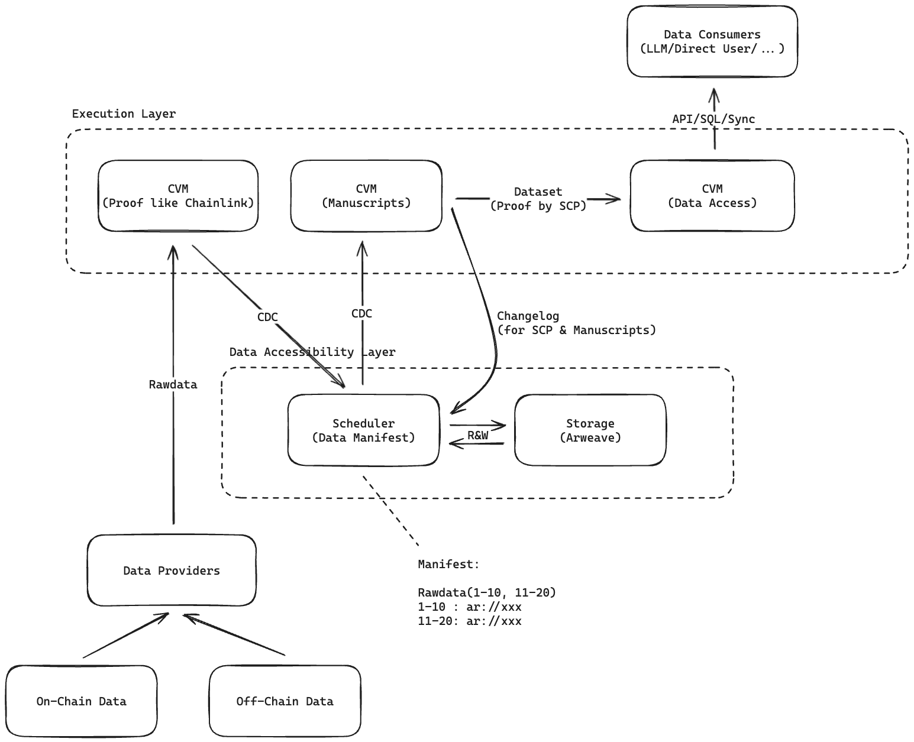
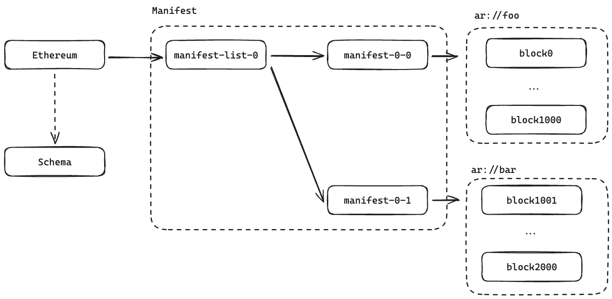
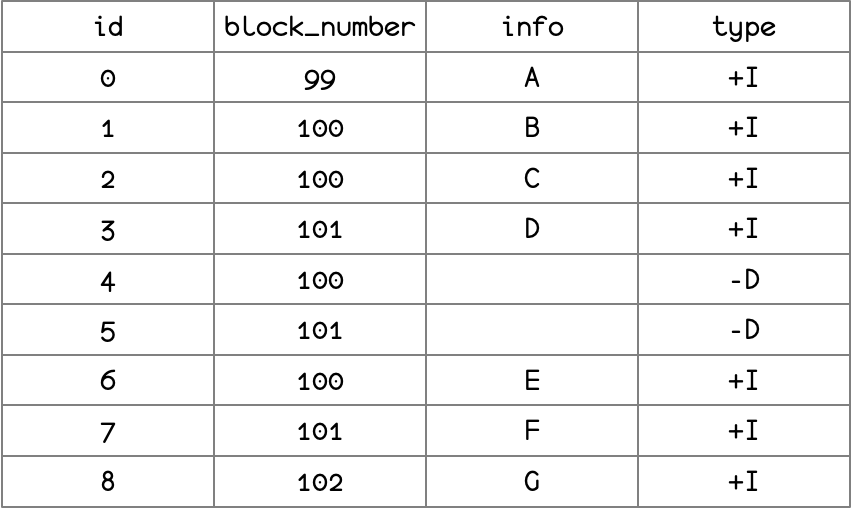
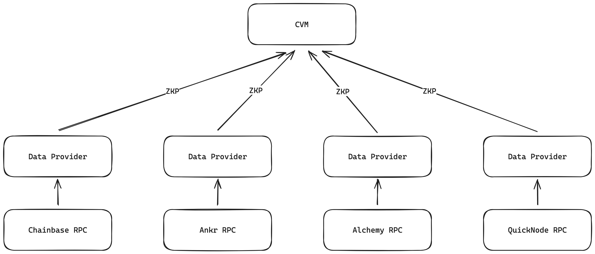
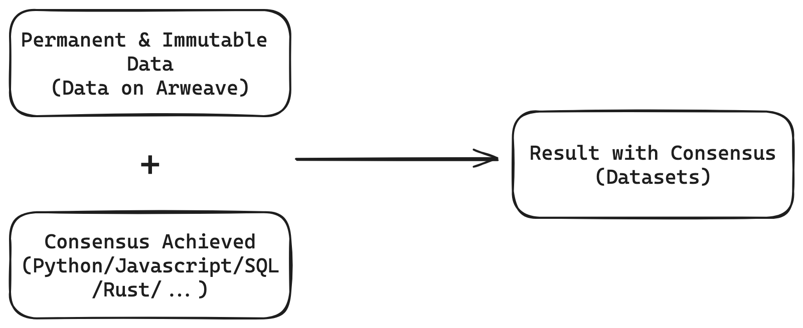

# Overview

## Glossary

- Data Providers: Provide On-Chain or Off-Chain data
- Data Consumers: Consumers like LLM / Developers / Data Engineer and so on.
- SCP: Storage-Based Consensus Paradigm. This is how the dataset is being proved.
- CDC(Changelog): Change Data Capture. Data stored permanently in Arweave, like changelog which generated by CDC.
- Dataset: Data set which is stored in any database or file system. It can be accessed directly by the data consumer through API / SQL / Sync.
- Data Manifest: Data manifest is a metadata file that contains the information about the dataset.

## Data Flow

1. Data Providers collect On-Chain & Off-Chain data, then push the data with Zero-Knownledge Proof to CVM. 
2. The CVM verifies the raw data provided by the Data Provider and writes the data permanently and immutably into Arweave in the form of a Changelog(CDC), while updating the data index in the Manifest.
3. The Manuscript consumes the raw data in a streaming manner using the CDC approach to extract and process high-value data.
4. The processed data can be directly stored in a database or local files, and the CVM provides direct data access services via SQL/API/Sync

# Solved Problems

## Distributed Data Lake

The raw data is stored immutably and in a decentralized manner on Arweave. The data is shared according to specific rules and uploaded to Arweave after sharding. The data shards are maintained through a Manifest and the query index is provided by the Scheduler.

The structure of the Manifest is as follows:

The data within the shards is stored in the form of a Changelog. The contents of the Changelog are as follows:

Storing data in the Changelog format has the following advantages:

1. Elegantly solves the Reorg issue in blockchain data.
2. Data is written in an Append Only manner, eliminating the need to handle conflicts, allowing for optimal data freshness.
3. The downstream CVM can continuously read upstream data in a streaming manner then process it. While benefiting from the compounding effect of upstream data, the downstream data also maintains good data freshness.

## Proof of Raw Data

Chainbase Network uses Zero-Knowledge Proof(ZKP) technology to prove the source and integrity of the data. Any network user can verify the source and validity of the data based on the ZKP.

The network’s raw data comes from decentralized Data Providers. These Data Providers obtain data from different Web3 RPC service nodes and use consensus algorithms to determine the final data results, thereby preventing any single data provider from supplying incorrect or malicious data.

Chainbase Network also establishes an SLA(Service Level Agreement) that Data Providers must adhere to regarding data quality and service standards. If Data Providers violate the corresponding SLA, they may face penalties.

## Proof of Indexed Data

Indexed Data is verified using SCP(Storaged-Based Consensus Paradigm).

The basic principles are as follows:

All verified Raw Data is immutably and persistently stored on Arweave. Manuscript is a data processing script written in programming languages such as Python, Javascript, Rust, and SQL, which are consensus already taken in the physical world. These data processing scripts will remain open-source, allowing any Validator to verify the generated Indexed Data based on Raw Data and Manuscript, thus achieving consensus on Indexed Data in a simple and effective manner

# Summary

In summary, Chainbase Network stands out by leveraging advanced technologies like Zero-Knowledge Proof(ZKP) and a Storage-Based Consensus Paradigm(SCP) to ensure data integrity and reliability. With decentralized and immutable storage on Arweave, and Manuscript for data processing, Chainbase Network offers robust data verification, seamless data services, and unparalleled data freshness. 

This decentralized data lakehouse establishes Chainbase Network as a leader in secure and efficient data management.