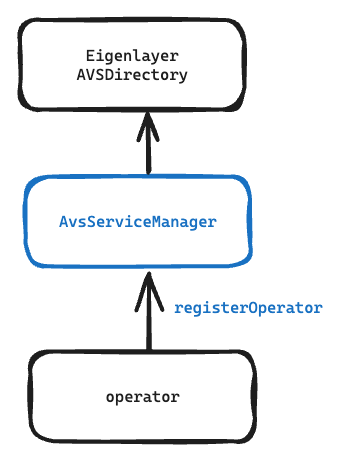
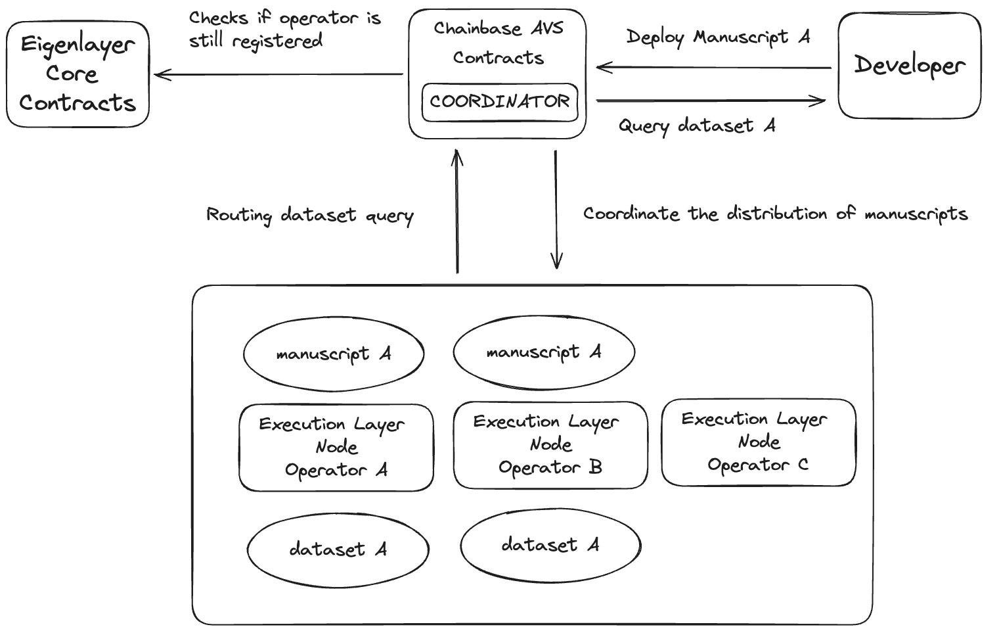
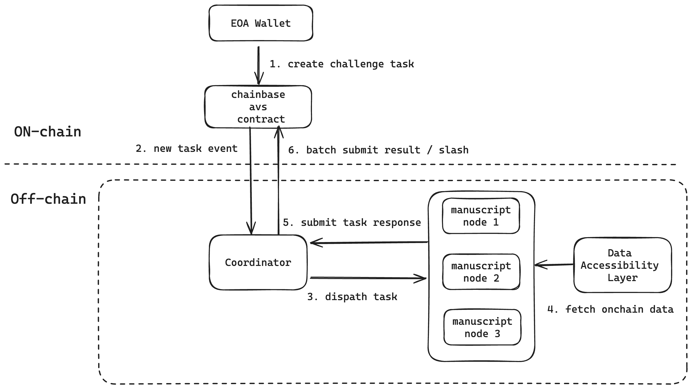

## Overview

Chainbase Network is an omnichain data network that leverages [dual-chain](/core-concepts/dual-chain) architecture combining [Cosmos](https://cosmos.network/cometbft/) and [EigenLayer](https://www.eigenlayer.xyz/) to enable trustworthy and transparent on-chain data processing. The network is integrated with EigenLayer's [Active Validator Set (AVS)](https://docs.eigenlayer.xyz/developers/avs-developer-guide) system, which provides a high-performance execution layer for large-scale data processing operations.

## Features

- Trustless Execution: Leverages Ethereum's security through EigenLayer
- Scalable Resources: Access to diverse operator network
- Transparent Processing: On-chain verification of results
- Economic Security: Staking-based operator incentives
- High Performance: Optimized task routing and execution

## Design

### Data Processing Nodes ###
EigenLayer operators register as nodes of Chainbase Network, provide computing resources, and profit through integrated data query fees. These operators collectively make up the network's [Execution Layer](/core-concepts/architecture/execution_layer), providing users with a node network for on-chain data processing.

### Manuscript Execution ###

Operators execute [manuscripts](/core-concepts/manuscript/), submitted by developers. As more and more manuscripts run on Chainbase Network, more operators are needed. To achieve elastic scaling of resources while maintaining high throughput, on-chain computing tasks get routed to the best operator [according to the needs](#manuscript-routing) of each deployed manuscript.

### Data Verification Challenges
Operational quality of operators is ensured by the network through an on-chain consensus game involving slashing operator rewards for non-compliance. For details on how the consensus game is played, see [verification challenges](#verification-challenges).

## Implementation

### EigenLayer Core (AVS Directory)
To integrate with EigenLayer Core, Chainbase Network implements an instance of ECDSAServiceManagerBase or ServiceManagerBase (BLS). This integration allows operators to register by sending transactions to the AvsServiceManager, completing the registration process

### Manuscript Routing

*Manuscripts* are routed to an operator based upon the following characteristics of said operator:
- geographic location
- computing power
- network conditions

**Publication** -
When a developer deploys a manuscript, the Chainbase `coordinator` coordinates the distribution of the manuscript to the appropriate operators. The manuscript is then available for other developers to query.

**Retrieval** -
Whenever a developer queries the network for a dataset defined by a manuscript, the Chainbase `coordinator` fetches a live operator who can answer the query from the list of Eigenlayer Core Contracts registered as operators.

### Verification Challenges 

The off-chain `coordinator` component periodically generates a challenge task. The `coordinator` calculates the block hash of a specific block from the data sets available on the network. The block hash is deterministic with a clear answer and expected outcome. The challenge is sent to operators' `manuscript-node` nodes, where they execute the task and return the signed result along with the recorded task execution time. This information is used to evaluate the operators' efficiency, and the results are verified on the AVS chain. The steps to completion are outlined in the diagram below:

