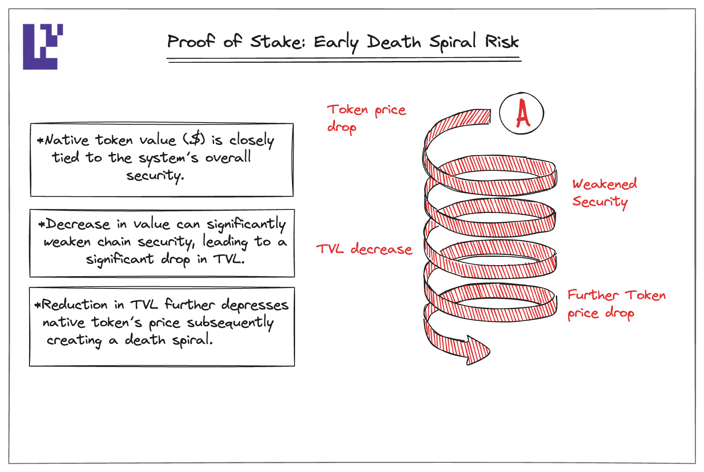
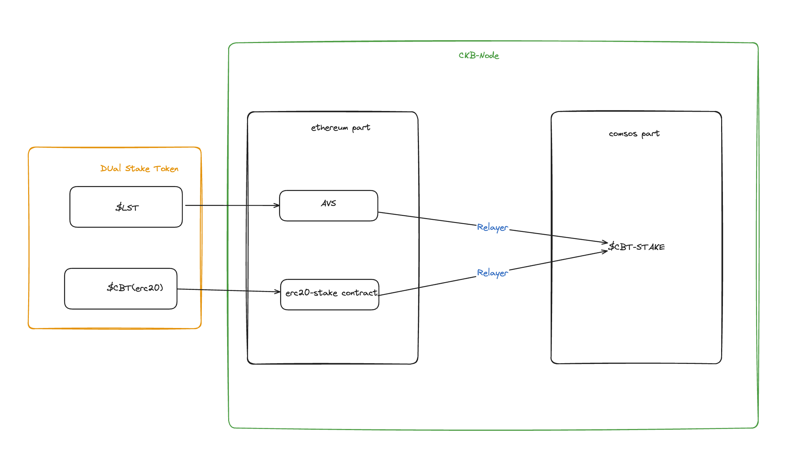

# Why dual staking?

- Early PoS (Proof of Stake) networks can face a "death spiral" problem. If the token's value decreases, it weakens the network's security, leading to a decline in Total Value Locked (TVL), which further depresses the token price, thus creating a death spiral.

capture:https://www.blog.eigenlayer.xyz
# How it works

Protect the same PoS network using two tokens, one of which can be a low-volatility, deep-liquidity, more accessible external network token such as Ethereum (ETH). Also use network native tokens to capture network value

# Different method

**Modular Dual Staking**: Local operators and ETH-backed operators are required to reach a quorum respectively.

**Native Dual Staking**: Similar to mesh security, two sets of operators are treated as one, each operator's stake is converted into unified units based on an external oracle, and the user then validates the response based on the combined quorum.

**Veto Dual Staking**: The local operator is first individually quorate and the ETH-backed operator acts as a safeguard to check the behavior of the local operator. If the local operator makes a mistake, the ETH-supported operator has the right to veto a valid response sent by them.

### Impl architecture

1. support LST && native token stake

for supported LST please check:https://app.eigenlayer.xyz/restake 

$CBT is our native token, for more detail TBD

2. how to manage stake token
- for LST part, staker first stake to operator then operator register  to our AVS. offline relayer watch && sync avs’s operator stake & delegations(eg.`sync(CainbaseAVS.Operator[] calldata operators`)) info with cosmos part(maybe call xxx chain ?)
- For the $CBT part, stakers interact with erc20-stake contract to emit a `Stake(bytes operator_pubkey, uint256 amount)` event. The relayer then watches for this event and syncs the information with the Cosmos part.
- We choose the Native Dual Staking model where an oracle ensures fair price conversion of both `$LST` and `$CBT` into `$CBT-Stake` units.
# **Reference**

- [Eigenlayer:Dual Staking: secure a PoS network with two tokens](https://www.blog.eigenlayer.xyz/dual-staking/)
- [osmosis-labs:Mesh Security Architecture](https://github.com/osmosis-labs/mesh-security/blob/main/docs/README.md)
- [dual staking and Espresso](https://youtu.be/o9y_pZUr0Nc?t=1727)
- [You Could've Invented EigenLayer | Kydo 0x - Eigen Labs](https://youtu.be/fCl_PucMytU?si=afSo2MK5oWJPeE69)