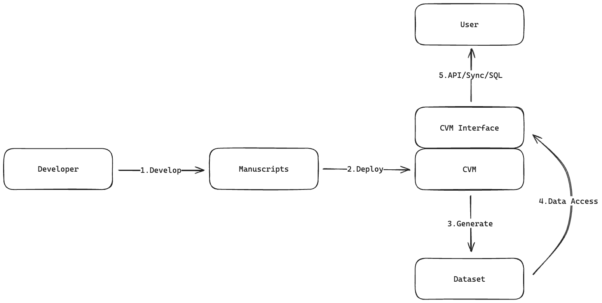

# Overview

Historically, alchemists often had formula books, also known as "alchemical manuscripts". These books contained recipes, procedures, and philosophical musings on turning base metals into gold, creating elixirs for immortality, and other transformative processes. The contents were typically written in cryptic and symbolic language to keep the knowledge secretive and exclusive.

Now, the datasets in the Chainbase Network is like base metals, and the alchemists (developers) can use Manuscripts to process this data, extracting greater value from the existing data.



# Protocol

Chainbase Network is committed to making data (on-chain & off-chain) more accessible, so Manuscripts allow users and developers to query and process data using SQL.

Manuscripts mainly consist of two parts.

- Schema: The definition of dataset.
- Operators: The extract, transform, and load methods which being used to extract greater value from the existing data.

## Schema

Schema can be defined like this.

```sql
CREATE TABLE ethereum.blocks (
    block_number bigint NOT NULL COMMENT 'Block number uniquely identifying the block',
    hash varchar(66) NOT NULL COMMENT 'Hash value representing the unique identity of the block(with bloom filter)',
    parent_hash varchar(66) NOT NULL COMMENT 'Hash value of the parent block(with bloom filter)',
    nonce varchar(78) COMMENT 'Nonce value associated with the block',
    sha3_uncles varchar(66) NOT NULL COMMENT 'SHA3 hash of the blocks uncle data(with bloom filter)',
    logs_bloom varchar COMMENT 'Logs bloom filter for events emitted in transactions',
    transactions_root varchar(66) NOT NULL COMMENT 'Root hash of the Merkle Patricia Trie for transactions(with bloom filter)',
    state_root varchar(66) NOT NULL COMMENT 'Root hash of the Merkle Patricia Trie for the state(with bloom filter)',
    receipts_root varchar(66) NOT NULL COMMENT 'Root hash of the Merkle Patricia Trie for receipts(with bloom filter)',
    miner varchar(42) NOT NULL COMMENT 'Address of the miner who mined the block(with bloom filter)',
    difficulty varchar(78) NOT NULL COMMENT 'Difficulty value representing the mining difficulty',
    total_difficulty varchar(78) COMMENT 'Total accumulated difficulty of the blockchain',
    size bigint COMMENT 'Size of the block in bytes',
    extra_data varchar NOT NULL COMMENT 'Extra data included in the block',
    gas_limit varchar(78) COMMENT 'Maximum gas limit allowed for transactions in the block',
    gas_used varchar(78) COMMENT 'Total gas used by transactions in the block',
    block_timestamp timestamp(3) NOT NULL COMMENT 'Timestamp of when the block was mined',
    transaction_count bigint COMMENT 'Number of transactions included in the block',
    base_fee_per_gas varchar(78) COMMENT 'Base fee per gas unit for transactions in the block',
    withdrawals_root varchar(66) COMMENT 'Root hash of the Merkle Patricia Trie for withdrawals',
    parent_beacon_block_root varchar COMMENT 'The hash tree root of the parent beacon block for the given execution block',
    excess_blob_gas bigint COMMENT 'The blob gas pricing.',
    blob_gas_used bigint COMMENT 'The total amount of blob gas consumed by transactions in the block'
);
```

Developers need to define the schema of the result table, including field names, field types, and field descriptions.

## Data Types

| Data Type       | Remarks for Data Type               |
| --------------- | ----------------------------------- |
| `CHAR`          |                                     |
| `VARCHAR`       |                                     |
| `STRING`        |                                     |
| `BOOLEAN`       |                                     |
| `BINARY`        |                                     |
| `VARBINARY`     |                                     |
| `BYTES`         |                                     |
| `DECIMAL`       | Supports fixed precision and scale. |
| `TINYINT`       |                                     |
| `SMALLINT`      |                                     |
| `INTEGER`       |                                     |
| `BIGINT`        |                                     |
| `FLOAT`         |                                     |
| `DOUBLE`        |                                     |
| `DATE`          |                                     |
| `TIMESTAMP`     |                                     |
| `TIMESTAMP_LTZ` |                                     |

## Operators

### SELECT & WHERE clause

The general syntax of the `SELECT` statement is:

```sql
select select_list from table_expression [where boolen_expression]
```

The `table_expression` refers to any data set in Chainbase Network. It could be an existing table, or VALUES clause, the joined results of multiple existing tables, or a subquery. The following would read all rows from `blocks`.

```sql
select * from blocks;
```

The `select_list` specification `*` means the query will resolve all columns.

Instead, a `select_list` can specify a subset of available columns or make calculations using said columns. For example, if `token_transfers` has columns name `token_id`, `token_value` and `token_decimal` you could write the following query:

```sql
select token_id, token_value / token_decimal from token_transfers;
```

Rows can be filtered based on a `WHERE` clause:

```sql
select * from ethereum.blocks where block_number = 19938860;
```

### ORDER BY clause

The `ORDER BY` clause causes the result rows to be sorted according to the specified expression(s). If two rows are equal according to the leftmost expression, they are compared according to the next expression and so on. If they are equal according to all specified expressions, they are returned in an implementation-dependent order.

```sql
select * from blocks order by block_timestamp, block_number;
```

### LIMIT clause

`LIMIT` clause constrains the number of rows returned by the `SELECT` statement. In general, this clause is used in conjunction with `ORDER BY` to ensure that the results are deterministic.

The following example selects the latest 10 blocks on blocks table.

```sql
select * from blocks order by block_timestamp limit 10;
```

### SELECT DISTINCT

If `SELECT DISTINCT` is specified, all duplicate rows are removed from the result set (one row is kept from each group of duplicates).

```sql
select distinct contract_address from token_transfer;
```

### Group Aggregation

An aggregate function computes a single result from multiple input rows. For example, there are aggregates to compute the `COUNT`, `SUM`, `AVG(average)`, `MAX(maximum)` and `MIN(minimum)` over a set of rows.

```sql
select count(1) from blocks
```

The standard `GROUP BY` clause is also supported for aggregating data.

```sql
select count(*) from token_transfer group by contract_address
```

### Joins

INNER Equi-JOIN:

```sql
select *
	, token_metas.token_decimal
from token_transfer
inner join token_metas
on token_transfer.contract_address = token_metas.contract_address
```

OUTER Equi-JOIN:

```sql
select *
	, token_metas.token_decimal
from token_transfer
left join token_metas
on token_transfer.contract_address = token_metas.contract_address
```

### INSERT Statement

`INSERT` statements are used to add rows to a dataset.

Syntax:

```sql
insert into table_name select_statement
```

Examples:

```sql
create table latest_10_blocks (
	  block_number bigint NOT NULL COMMENT 'Block number uniquely identifying the block',
    hash varchar(66) NOT NULL COMMENT 'Hash value representing the unique identity of the block(with bloom filter)',
    parent_hash varchar(66) NOT NULL COMMENT 'Hash value of the parent block(with bloom filter)',
    nonce varchar(78) COMMENT 'Nonce value associated with the block',
    sha3_uncles varchar(66) NOT NULL COMMENT 'SHA3 hash of the blocks uncle data(with bloom filter)',
    logs_bloom varchar COMMENT 'Logs bloom filter for events emitted in transactions',
    transactions_root varchar(66) NOT NULL COMMENT 'Root hash of the Merkle Patricia Trie for transactions(with bloom filter)',
    state_root varchar(66) NOT NULL COMMENT 'Root hash of the Merkle Patricia Trie for the state(with bloom filter)',
    receipts_root varchar(66) NOT NULL COMMENT 'Root hash of the Merkle Patricia Trie for receipts(with bloom filter)',
    miner varchar(42) NOT NULL COMMENT 'Address of the miner who mined the block(with bloom filter)',
    difficulty varchar(78) NOT NULL COMMENT 'Difficulty value representing the mining difficulty',
    total_difficulty varchar(78) COMMENT 'Total accumulated difficulty of the blockchain',
    size bigint COMMENT 'Size of the block in bytes',
    extra_data varchar NOT NULL COMMENT 'Extra data included in the block',
    gas_limit varchar(78) COMMENT 'Maximum gas limit allowed for transactions in the block',
    gas_used varchar(78) COMMENT 'Total gas used by transactions in the block',
    block_timestamp timestamp(3) NOT NULL COMMENT 'Timestamp of when the block was mined',
    transaction_count bigint COMMENT 'Number of transactions included in the block',
    base_fee_per_gas varchar(78) COMMENT 'Base fee per gas unit for transactions in the block',
    withdrawals_root varchar(66) COMMENT 'Root hash of the Merkle Patricia Trie for withdrawals',
    parent_beacon_block_root varchar COMMENT 'The hash tree root of the parent beacon block for the given execution block',
    excess_blob_gas bigint COMMENT 'The blob gas pricing.',
    blob_gas_used bigint COMMENT 'The total amount of blob gas consumed by transactions in the block'
);

insert into latest_10_blocks
select * from blocks order by block_number desc limit 10;
```

## GPL

For experienced alchemists, a General-perpose Programming Language (GPL), such as Python or JavaScript, can be used to extract and process data. GPL will provides the most flexible and powerful data extraction capabilities

**Coming Soon…**
