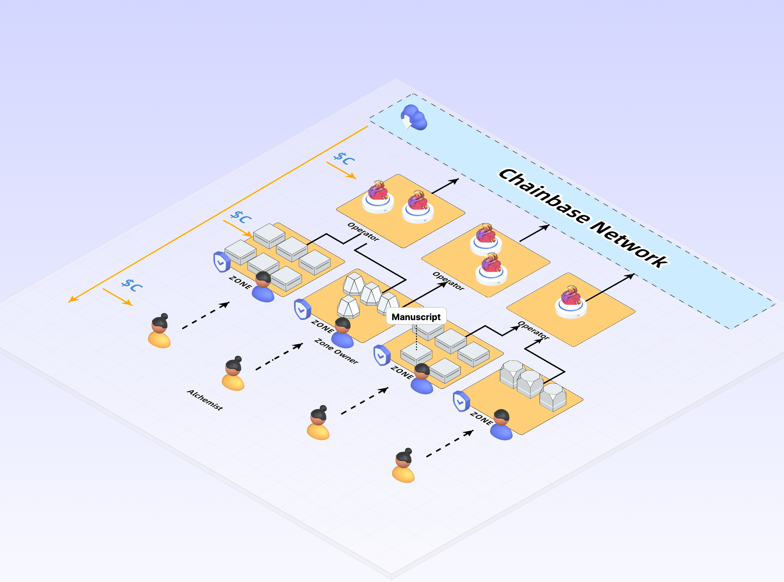
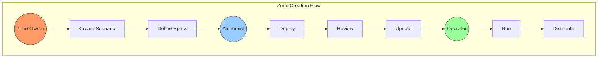

## Overview


A Chainbase Zone is a specialized data processing domain within the Manuscript framework that focuses on parsing and analyzing blockchain data for specific sectors or use cases. Zones are collections of Manuscript implementations that work together to provide comprehensive data solutions for particular blockchain domains.

Zones in Chainbase provide several key capabilities:

1. **Data Specialization**: Focus on specific blockchain domains (DeFi, NFTs, Gaming, etc.)
2. **Custom Processing**: Define specialized data processing workflows for your domain
3. **Interoperability**: Connect with multiple data sources and output formats
4. **Monetization**: Earn rewards by providing valuable processed data to the network

## Zone Roles and Workflow
The Chainbase Zone ecosystem consists of multiple key roles that work together to ensure efficient and high-quality data processing.

### Core Roles

1. Zone Owner
- Responsible for creating and managing domain-specific data processing scenarios
- Defines the business scope and technical specifications of the Zone
- Reviews and updates Manuscripts within the Zone
- Manages the Zone's economic model and reward mechanisms

2. Alchemist (Developer)
- Develops Manuscripts based on Zone specifications
- Implements and optimizes data processing logic
- Provides technical support and maintenance
- Participates in Zone technical upgrade discussions

3. Operator
- Selects and runs specific Zones
- Provides computational resources and infrastructure support
- Ensures stable operation of all Manuscripts within the Zone
- Monitors system performance and handles exceptions

## Workflow Process



# Create a Chainbase Zone

## Recommended Flow for Deploying Your Zone

Before deploying your first zone on the mainnet, we strongly recommend following this order:

1. **Local Development**: Create and test your zone locally with sample data processing workflows
2. **Testnet Deployment**: Deploy your zone on Chainbase testnet to validate your data processing pipelines
3. **Mainnet Launch**: After thorough testing, deploy your zone on the Chainbase mainnet

## Prerequisites

To create a zone, ensure you have:
- Installed Chainbase Manuscript framework
- Created a emv wallet

## Creating a Local Zone

### Step 1. Set up Local Development Environment

```bash
# Install Manuscript core dependencies
git clone https://github.com/chainbase-labs/manuscript-core
cd manuscript-core
make install gui # or cli
```

### Step 2. Configure Zone (Coming soon..)

## Zone Lifecycle Management

### Performance Monitoring
Zones are evaluated based on:
- Data processing throughput
- Query response times
- Data accuracy and completeness
- Network utilization

### Deregistration
Poor-performing zones may be deregistered if they:
- Consistently fail to meet performance metrics
- Process invalid or corrupted data
- Violate network policies

## Best Practices

1. **Testing**: Thoroughly test your zone's data processing pipelines before mainnet deployment
2. **Documentation**: Maintain clear documentation for your zone's capabilities and usage
3. **Monitoring**: Implement robust monitoring for your zone's performance
4. **Updates**: Regularly update your zone's components to maintain compatibility and security

## Community Contribution

The success of Chainbase Zones depends on community participation. Contributors can:
- Develop new specialized zones for different blockchain sectors
- Improve existing zone implementations
- Share zone templates and best practices
- Participate in zone governance decisions

For more information about contributing to the Chainbase ecosystem, visit our [community guidelines](https://docs.chainbase.com/contributing/overview).
