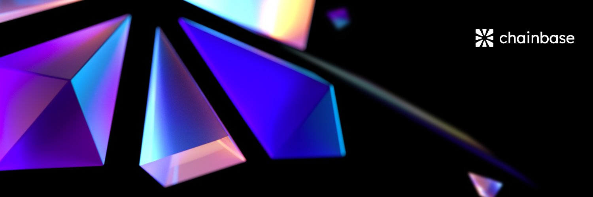

Chainbase is the world's largest **omnichain data network** designed to integrate all blockchain data into a unified ecosystem, providing an open and transparent data interoperability layer for the AI era. 

It has designed a novel **dual-chain** technology architecture that bridges the programmability and composability of crypto data, which supports high throughput, low latency, and eventual determinism, as well as higher cybersecurity through a dual staking model.

Our mission is to **make data accessible and useful**. With Chainbase, people can truly enjoy the benefits of the open internet era.

# Learn

If you want to learn more, get started by diving into these concepts:

- [Network Overview](/introduction/networks/overview) - Get a quick overview of the Chainbase network in one panoramic view.
- [Core Concepts](/core-concepts/dual-chain) - Getting to know Chainbase from its dual-chain architecture.
- [Glossary](/core-concepts/glossary) - Some terms make it easy to understand the whole world.
- [Roadmap](/contributing/roadmap) - Introduce in detail how Chainbase achieves interoperability, security and sustainability.

# Use Cases

What can Chainbase be used for? Consider the following examples of potential applications that are now possible with Chainbase:

1. **Wallet**: Enables wallets to manage and view assets on multiple blockchains from a single interface, improving user convenience.

2. **Security**: Tracks attacks, provides security alerts, and performs in-depth security analysis to protect the blockchain network.

3. **AI**: Facilitates the deployment of AI models that use data from multiple blockchains, enhancing accuracy and decentralization.

4. **Social**: Builds social platforms where users from different blockchains can interact and share content seamlessly.

5. **Infrastructure**: Provides a robust infrastructure for building applications that utilize data from multiple blockchains.

6. **DeFi**: Enables DeFi platforms to support lending and borrowing across different blockchains, increasing liquidity and flexibility.

# Contributing

To learn about how to contribute to the network, including this documentation site, check out the [Contributing](/contributing/overview) section.