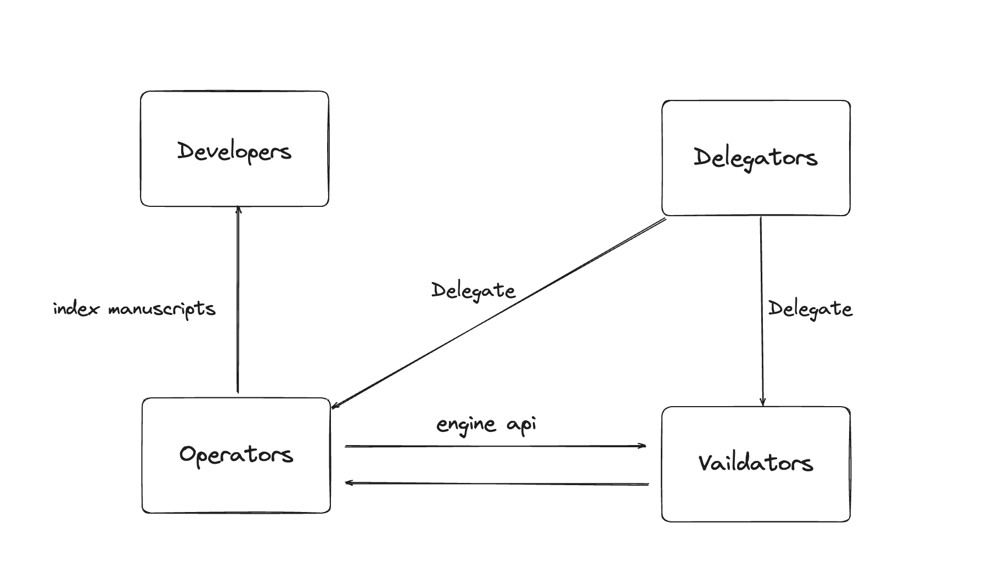

The Chainbase Network is composed of Operators, Validators, Developers, and Delegators who provide services to the network and supply data to Web3 applications. Consumers utilize these applications and consume the data.

TL;DR
- developers build [manuscripts](../../core-concepts/manuscript.mdx)
- operators index [manuscripts](../../core-concepts/manuscript.mdx)
- validators maintain network consensus
- delegators delegate to operators && validators enhance the economic security

## Developers

Developers are both the demand and supply side of the network's data. Developers build manuscripts and publish them to the network to earn rewards, and at the same time, when they build Dapps, they query network data, becoming users of the network.

### Local Development

Developers use the `chainbase-sdk` to build manuscripts locally, for details refer to [developers details](xxx).

### Testing and Validation

After development, manuscripts can be deployed to our sandbox environment, where developers have the opportunity to validate their manuscripts in advance to ensure there are no indexing errors and that they work as expected.

### Publishing

When developers are satisfied with their manuscripts, they can publish them to the network. This is an on-chain operation that registers the manuscript so that indexers (operators) can discover it.

## Operators

Operators play a crucial role in the network by providing the necessary computational resources for the execution layer, ensuring the smooth operation of data processing tasks. Operators are rewarded in a manner akin to proof-of-work, with greater workloads demanding higher hardware requirements, for details refer to [operator details](xxx).

To become an Operator in the network, one must first register as an operator on the Holesky testnet or the mainnet of the Eigenlayer smart contract. This will register your Ethereum public key with the Eigenlayer smart contract. You can follow the instructions on [Eigenlayer](https://docs.eigenlayer.xyz/eigenlayer/operator-guides/operator-installation).

## Validators

Validators play a key role in maintaining the security and consensus of the network. They are responsible for ensuring data integrity and maintaining network stability. Validators in the network reach consensus through an improved cometbft and use DPOS to determine voting weight based on the size of the staked $CBT data.

There are certain hardware and software requirements to become a validator in the network. If you wish to become a validator, please contact the team.

## Delegators

Delegators enhance the economic security of the network by staking their tokens to validators and operators. The Chainbase network uses a dual staking mechanism, where delegators can choose to stake `$ETH (or LST)` and `$CBT`.
