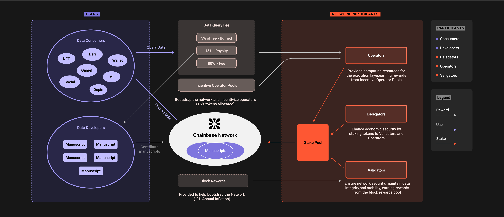

## **Overview**

CBT is the native token of our decentralized data network, designed to facilitate and incentivize various activities within the ecosystem. The tokenomics model aims to support a sustainable and secure network by aligning the incentives of all participants, ensuring the efficient operation of both the execution and consensus layers, and fostering ongoing development and usage of the network. CBT serves as a utility token for coordinating data providers and consumers within the network, incentivizing protocol participants to effectively organize data.

By using our network, users can easily access data, paying only for the specific information they need. Our network plays a crucial role in making blockchain data more accessible and facilitating its exchange.

## **Reward Structure**

The reward structure of CBT is designed to incentivize network participation and ensure the growth and sustainability of the ecosystem. Rewards are primarily distributed through:

### **Data Query Fees**
Data developers create Manuscripts for processing blockchain data, and the resulting datasets can be queried and used. These query operations require the payment of CBT fees.

Data developers pay a certain amount of CBT to the network when querying datasets, which covers the costs of data retrieval and serves as a reward for network resource providers (such as Operators and Validators), ensuring they continue to provide high-quality services.

**Distribution:**
- **80%** is distributed to Operators and their delegators. This portion of the fees primarily incentivizes Operators to maintain and optimize computing resources, ensuring efficient data query processing.
- **15%** is distributed to Developer. Encourage developers to provide high-quality manuscript data processing logic.
- **5%** of the data query fee is burned.

### **Incentive Operator Pools**
A total of 15% of the CBT token supply will be allocated over 6 years, with 2% unlocked annually. This is to incentivize Operators to provide reliable and diverse computing resources, supporting the network in achieving large-scale data processing.

**Distribution:**
- **100%** is distributed to Operators and their delegators based on the quality and quantity of data processing services provided for blockchain projects.

### **Block Rewards**
Provided to help bootstrap the Network (-2% Annual Inflation)

- This fixed proportion ensures the sustainability and long-term incentives of the network.
- Block rewards are primarily used to incentivize Validators to maintain the security and stability of the network and ensure the proper functioning of the blockchain.

**Distribution:**
- **100%** is distributed to Validators and their delegators, who maintain the consensus mechanism of the blockchain and verify transactions.

## **Roles and Incentives**

### **Operators**
Operators play a crucial role in the network by providing the necessary computing resources for the execution layer, ensuring that data processing tasks run smoothly.

- Responsibilities include:
    - Maintaining and managing computing infrastructure to ensure efficient operation.
    - Processing and executing data query requests submitted by data developers.
    - Ensuring network stability and responsiveness, providing high-quality services.

#### **Incentives**

- Receive 80% of data query fees, incentivizing them to maintain and optimize computing resources for efficient data query processing.
- Receive 100% of the rewards from the incentive operator pools, encouraging them to provide efficient data processing services for blockchain projects.

### **Validators**
Validators play a critical role in maintaining network security and consensus. They are responsible for verifying transactions, ensuring data integrity, and maintaining network stability.

- Responsibilities include:
    - Verifying and confirming transactions to ensure their legality and accuracy.
    - Maintaining the network's consensus mechanism, preventing malicious behavior and attacks.
    - Participating in network governance, proposing and voting on network improvements and development directions.

#### **Incentives**
- Receive 100% of block rewards, incentivizing them to maintain network security and stability, and ensure the proper functioning of the blockchain.

### **Data Developers**
Data developers are responsible for contributing code for data transformation, making datasets available within the network, and querying dataset results.

- Responsibilities include:
    - Building and maintaining data transformation code (Manuscripts) to ensure datasets can be effectively processed and queried.
    - Conducting data queries to obtain the necessary results, supporting applications.
    - Participating in network development and improvement, proposing new features and optimizations.

#### **Incentives**
- Receive 15% of data query fees to provide high-quality manuscript data processing logic

### **Delegators**
Delegators enhance the network's economic security by staking tokens to Validators and Operators.

- Responsibilities include:
    - Selecting and supporting high-performance Validators and Operators by staking CBT, enhancing their economic security.
    - Monitoring and evaluating the performance of Validators and Operators to ensure they provide high-quality services.
    - Participating in network governance by voting on proposals and influencing the network's development and direction.

#### **Incentives**

- Earn a share of the rewards earned by the Validators and Operators they support. Delegators share in the rewards by staking tokens to Validators and Operators.
- Receive additional incentives for supporting high-performance Validators and Operators to ensure network security and stability.

## **Economic Sustainability**

Ensuring the long-term value and stability of CBT is crucial for the success of the network. We have implemented several mechanisms to prevent inflation and maintain the utility of the token:

### **Inflation Control**

- **Annual Cap**: Token issuance is capped at 3% per year to prevent excessive inflation.
- **Controlled Distribution**: Newly issued tokens are carefully allocated to maintain network security and incentivize participation without excessively diluting token value.

### **Utility Maintenance**

- **Broad Utility**: CBT tokens are required for various activities within the network, including query fees, staking, and accessing datasets, ensuring continuous demand.
- **Fee Adjustments**: Query fees can be adjusted based on network activity and demand to balance economic incentives and operational costs.

### **Economic Security**

- **Staking**: Validators and Delegators must stake CBT tokens, aligning their economic interests with the network's security and stability.
- **Performance Incentives**: High-performing Operators and Validators receive greater rewards, promoting continuous improvement and network reliability.

By integrating these elements, the CBT tokenomics model aims to create a balanced and sustainable ecosystem that fairly rewards all participants and promotes the long-term success of our decentralized data network.