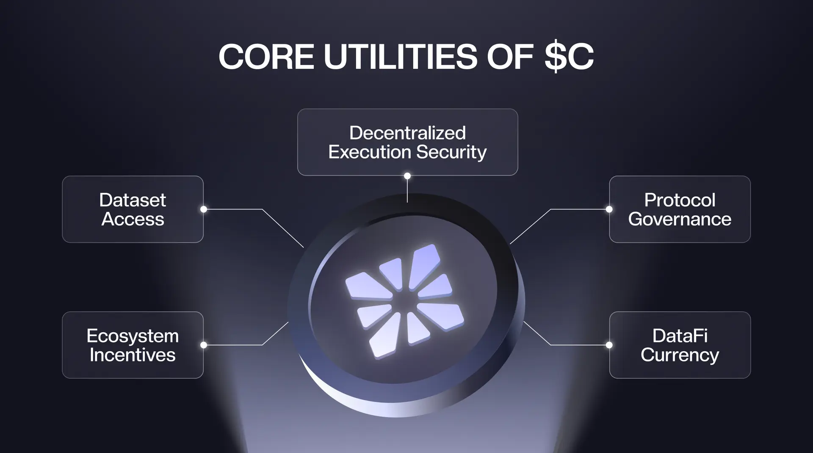
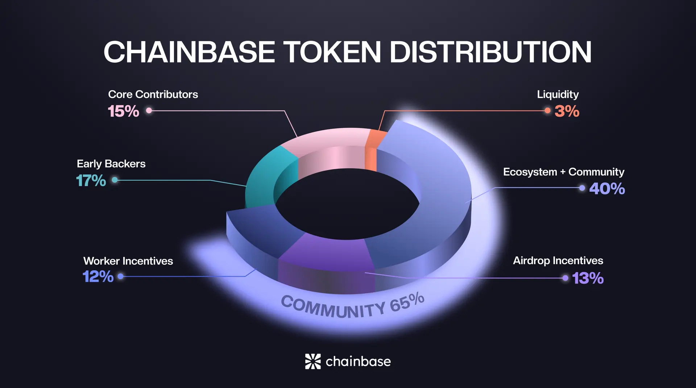
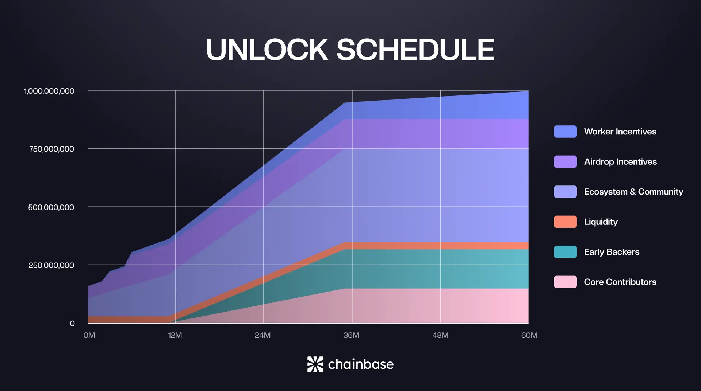

# The Age of AI Demands a New Data Economy

Data is the foundation of artificial intelligence.

As AI grows more autonomous and deeply embedded into digital infrastructure, high-quality data has become the most valuable asset.

Yet, current data systems aren't built for intelligent machines. Blockchain data remains fragmented, unstructured, unverifiable, and lacks pricing or incentive model. There's no native mechanism to value, trade, or coordinate data effectively.

Chainbase introduces a new standard: **Hyperdata Network**. Designed for the AI-native internet, it transforms raw blockchain activity into structured, composable, and machine-consumable data. It enables autonomous agents, protocols, and humans to access and coordinate through a shared data layer.

At the heart of this ecosystem is **$C**. It powers AI and the broader DataFi economy.

## What is $C?

$C is the foundational asset of DataFi ecosystem, enabling the production, exchange, and governance of structured data across AI and crypto.

### Core Utilities of $C

#### Dataset Access
Agents, apps, and protocols use $C to query and consume structured data.

#### Ecosystem Incentives
Distributed to developers, contributors, and users based on their activity and value to the network.

#### Decentralized Execution Security
Staked to support and validate data processing through the AVS layer.

#### Protocol Governance
Token holders vote on protocol upgrades, incentive models, and network parameters.

#### DataFi Currency
Serves as the standard unit of account and settlement across the Chainbase ecosystem.

## Token Distribution

Chainbase has allocated 65% of the total $C supply to ecosystem growth, contributor rewards, and user incentives. This reflects Chainbase's commitment to open participation and long-term alignment.

### Token Distribution Breakdown

- **Ecosystem + Community (40%)**: Reserved for grants, integrations, developer incentives, campaign rewards, and long-term community growth. This allocation supports open access and sustained participation in the Chainbase network.

- **Airdrop Incentives (13%)**: Distributed over three seasons to reward strategic partners (e.g: Season 1 allocates 3.5%, including 2% native community incentives and an additional 1.5% Binance Alpha), developers, users, project teams, and contributors who actively support ecosystem growth.

- **Worker Incentives (12%)**: Allocated to participants who operate data nodes and support Chainbase's decentralized infrastructure.

- **Early Backers (17%)**: For initial investors who provided early support and guidance to the project.

- **Core Contributors (15%)**: Reward for founding team members and core builders, with allocations optimally aligned with long-term protocol success.

- **Liquidity (3%)**: Reserved for exchange support and healthy market dynamics.

**Total supply**: 1,000,000,000 $C

**Initial Unlocked Supply**: 16%

## Unlock Schedule

The $C release model is structured to ensure long-term stability and meaningful participation.

### Core Team & Early Backers
Tokens vest over 3 years, with a 12-month cliff followed by linear distribution over 24 months—designed to incentivize long-term contribution.

### Sustained Incentives for Infrastructure Operators
Worker Incentives, distributed to participants operating data nodes, vest linearly over 60 months, ensuring consistent support for the decentralized infrastructure that powers the Chainbase network.

### Ecosystem-Aligned Emissions
Tokens allocated to ecosystem development unlock linearly over 36 months, aligned with developer growth, incentive programs, and platform adoption milestones.

This phased rollout model allows $C supply to expand in parallel with real usage, mitigates short-term speculation pressure, and reinforces sustainable participation in the DataFi economy.

## Launching on Base and BNB Chain

$C will launch primarily on Base, with additional liquidity provided on BNB Smart Chain (BSC). This dual-chain approach enables the Chainbase ecosystem to:

- Leverage Base's performance, low fees, and strong developer ecosystem
- Provide access to broader liquidity and user base through BSC
- Cross-chain utility and trading

This approach ensures a smooth launch and positions Chainbase for long-term interoperability across Web3 ecosystems.

## Why $C Matters

Data is no longer passive infrastructure. **It is capital**.

$C turns raw data into an economic asset. It facilitates autonomous coordination, rewards real contributions, and enables an open, AI-ready data economy.

Chainbase provides the infrastructure. $C brings it to life by making the infrastructure liquid, scalable, and usable to everyone.

## About Chainbase

Chainbase is building the Hyperdata Network for AI — a foundational layer for the DataFi era.

Built as a Hyperdata Network, Chainbase turns onchain signals into structured, verifiable, and AI-ready data that can be directly processed by AI models and decentralized applications. Its core stack includes:

- **Manuscript**: a programmable layer for building data assets
- **AVS layer**: decentralized data execution and verification
- **C Token**: the native currency for AGI

This structured data layer supports a new generation of crypto applications that are autonomous, composable, and economically aligned with their users and contributors.

### Key Achievements

To date, Chainbase has:
- Indexed over 200 blockchains
- Processed more than 500 billion data calls
- Supports a community of more than 35,000 developers
- Over 10,000 projects actively use Chainbase across a wide range of use cases, including MEV infrastructure, L2 explorers, agent protocols, and onchain analytics

### Team & Backing

The founding team brings deep experience in blockchain infrastructure, data engineering, and protocol security. Chainbase is backed by top-tier investors and works closely with ecosystems across modular infrastructure, large language models, and onchain AI.

As the need for machine-readable and economically aligned data continues to grow, Chainbase provides the foundational layer for a programmable data economy—one where information moves freely between agents, protocols, and people.

### Links
[Website](https://chainbase.com) | [Twitter](https://twitter.com/chainbase) | [Telegram](https://t.me/chainbase) | [Blog](https://blog.chainbase.com) | [Docs](https://docs.chainbase.com) | [Github](https://github.com/chainbase)
