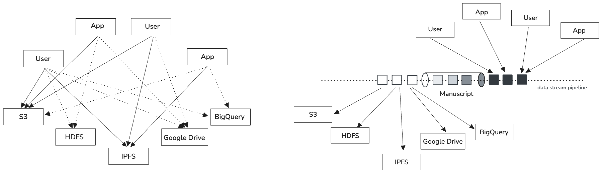
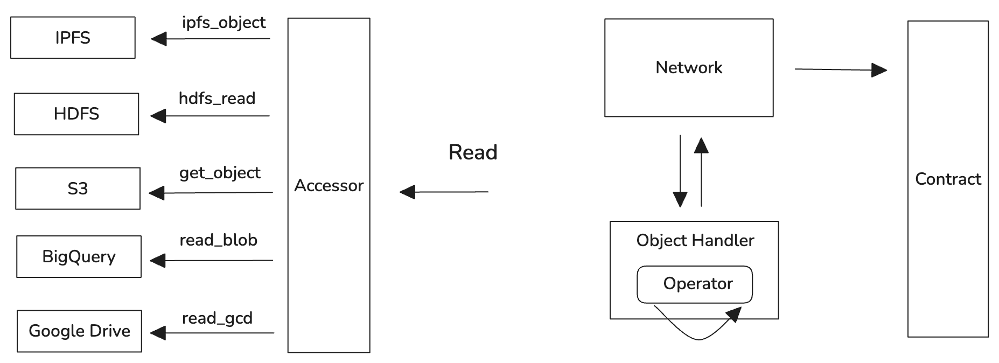

# Manuscript

<Check>👉👉 https://github.com/chainbase-labs/manuscript-core</Check>

# What is Manuscript?
Manuscript is a revolutionary blockchain data streaming framework. With Manuscript, you can seamlessly integrate on-chain and off-chain data into target data storage for unrestricted querying and analysis.

# Vision of Manuscript

The vision of Manuscript is to realize "data trade" within the Chainbase network, establishing a Chainbase ecosystem component that allows users to access any data through any means, across any service, using any language. This grand vision can be broken down into the following key aspects:

- Any language: We hope users can use scripts in any mainstream programming language to customize data, including but not limited to: Golang, Rust, Python, Node.js, Java, C/C++, Zig, WebAssembly (WASM)
- Any method: Different users are familiar with different forms of data access, we hope users can access data through various means, including but not limited to: SQL, DataFrames, HTTPS, gRPC, FTP, WebDAV, FUSE
- Any data: Users should be able to access data in any format, such as: JSON, CSV, ORC, XML, XLSX, BLOB
- Across any service: Users' expected data storage services also vary, we hope users can access, transfer, and control data in any service, such as: RPC, S3, IPFS, Azblob, HDFS, Google Drive, BigQuery, WebDAV, MySQL, PostgreSQL

In the Chainbase ecosystem, on-chain data can be tagged, categorized, and processed, transforming complex data into easily understandable and usable forms. Artificial intelligence algorithms can automatically analyze massive blockchain data, discovering hidden patterns, trends, and anomalies, helping users gain insights from the data. Manuscript provides rich tools and resources for this process, making data processing more efficient and transparent. Through these technical means, Manuscript not only makes access to on-chain data more free and flexible but also greatly enhances the value of data, allowing more people to easily use and apply this on-chain data.

# Value of Manuscript

1. Programmability:
Manuscript provides powerful programmable interfaces that allow developers to customize data processing workflows according to their needs. This flexibility means that Manuscript can be used not only for simple data queries but also for building complex data analysis pipelines and applications. Through programmability, Manuscript opens up infinite possibilities for innovative applications of blockchain data.

2. Interoperability:
With the booming development of blockchain technology, it's becoming increasingly difficult for different blockchains to understand and process each other's data. Manuscript can solve the interoperability problem of multi-chain and off-chain data aggregation in any dimension. By providing unified interfaces and data processing methods, Manuscript enables seamless integration of data from different blockchains, greatly improving the development efficiency and feasibility of cross-chain applications.

3. Monetization:
Leveraging the data capabilities provided by Manuscript, combined with the dual-chain architecture CometBFT + DPoS high-performance instant transaction finality and proof-of-stake consensus features, Chainbase offers a fair and transparent data value exchange ecosystem. Creators can monetize their processed data through Manuscript, while data users can conveniently consume the data they need. This mechanism not only incentivizes the production of high-quality data but also promotes the positive development of the entire blockchain ecosystem.

# Design of Manuscript

As the data access layer in the Chainbase network, Manuscript needs to interface with a large number of existing data protocols. Its core design philosophy revolves around modularity and scalability, consisting of the following key components:

1. Accessor (Data Source):
 - As the lowest-level interface, all services need to implement this interface, responsible for translating upper-layer calls into lower-level requests
 - For example, translating a read request into corresponding service API calls
 - Provides a unified data access abstraction, shielding the differences in underlying storage and services

2. Processor (Data Method):
 - High-level methods oriented towards users, allowing them to conveniently create read and write requests
 - Provides operations such as SQL syntax, initializing Datasets, etc.
 - Encapsulates complex data interoperation underlying logic, providing a concise user interface

3. Handler (Data Target):
 - Handles specific read and write requests, manages the lifecycle of data objects, implements data serialization and deserialization
 - Deals with data consistency and concurrency issues
 - For example, writing user-processed data to local relational databases like MySQL, PostgreSQL, etc.

4. Signer (Proof of Stake):
 - Allows users to pre-generate signed URLs, supporting temporary authorized access, enhancing the security of data access
 - Implements permission management and stake allocation proof interfaces based on smart contracts

# Manuscript Community

The Chainbase Network provides an open, trustless, and permissionless data ecosystem network, encouraging data democratization and monetization, where both users and data providers can participate without authorization from any governing body. Through Manuscript, participants can produce high-quality data and profit from it.

The success and development of Manuscript rely on active community support. It is not an isolated service, but an open ecosystem. Only with the power of the community can Manuscript fully realize its potential and achieve flourishing development. We encourage community members to:

- Contribute new Accessor implementations to support more data sources and services
- Develop innovative data and applications based on Manuscript
- Participate in documentation writing and tutorial creation to help more people understand and use Manuscript
- Propose improvement suggestions and report issues to drive the continuous improvement of Manuscript
- Organize online and offline exchange activities to share user experiences and best practices

Through the power of the community, we believe Manuscript will become an important data component in the Chainbase data world, bringing more innovation and value to the entire industry.